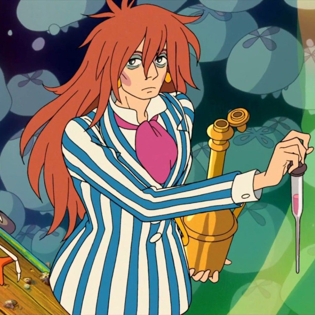

.. FUCrIMODo documentation master file, created by
   sphinx-quickstart on Thu Sep 12 15:25:51 2024.
   You can adapt this file completely to your liking, but it should at least
   contain the root `toctree` directive.

FUCrIMODo
=========

FUCrIMODo is a program that aims to retrieve the crystal structure from
a SOAP descriptor.
This is done with the help of a novel multi-stage Genetic Algorithm (GA).

.. toctree::
   :maxdepth: 1
   :caption: Contents:

   modules/core/index
   modules/analysis/index
   modules/customs/index

Indices and tables
==================

* :ref:`genindex`
* :ref:`modindex`
* :ref:`search`
