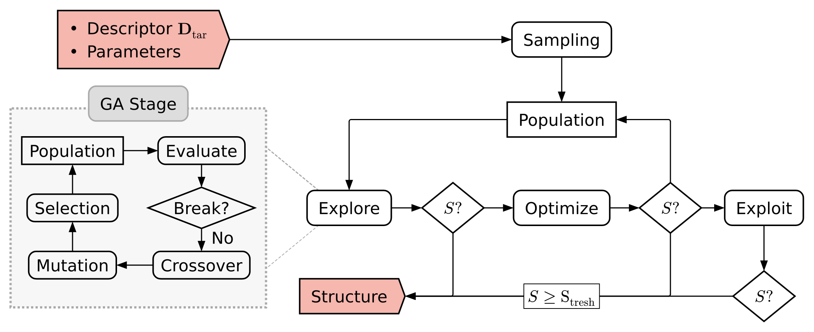

===========
Core Module
===========

The core module contains the framework to implement the multi-stage
search algorithm. At its center is the :class:`MultiStageSearch` class which
handles the data and time-keeping, as well as organizing and running stages.

.. toctree::
   :maxdepth: 1

   multi_stage_search

------------------
Abstract Framework
------------------

.. currentmodule:: fucrimodo.core.modules

In addition to the main framework the core module adds the abstract :class:`Stage` to set up the individual parts of the optimization algorithm and some useful abstract base classes, needed in most optimization algorithms:

.. autosummary::
   :signatures: none

   Stage
   Individual
   Population
   BreakCondition
   FitnessFunction
   PopulationGenerator
   PopulationSelection

An example for a multi stage search to invert the global SOAP descriptor is
provided in the paper [TODO: Add paper ref].

    Multi-stage optimization workflow to invert the global SOAP descriptor.
    Its implementation is located here [TODO: Add link to example workflow].

.. toctree::
   :maxdepth: 1

   modules

---------
Utilities
---------
.. currentmodule:: fucrimodo.core.utils

Apart from the abstract framework the core includes utilities for
performing the algorithm and interfacing with the framework.

.. autosummary::
   :signatures: none

   CustomCellBounds
   CustomClosestDistances
